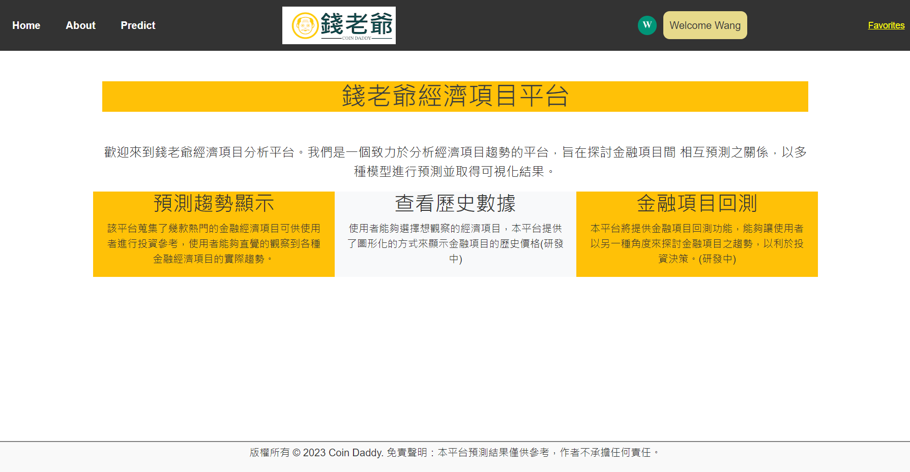

## 製作項目
1. 製作Navigation bar
2. Home Page
3. About Page
4. Predict page放到Navigation bar
5. 使用者頭像
6. 歡迎語句
7. 我的最愛介面

## Navigation bar
  

  
預設頭像會根據你名稱的首字母來顯現

## Home page
  
介紹此平台的創立宗旨及服務業務。

## About Page
 
放置本平台的介紹影片

## Predict Page
  

  
能選擇預測的項目，但好像之前訓練的時候把三個公司的油價都混在一起變成一個變量(他們應該要是獨立的變量)，所以要進行修改。

## 頭像功能
  

將鼠標放置在Welcome的文字框上面會跑出個人訊息與登出之選項
> 個人訊息頁面還沒製作

## Favorites Page
  
可以選擇最多`3種`金融經濟項目，按下提交後會導向Home Page 此時Home Page應該要有你選擇的金融經濟項目選項，你可以點選選項查看此經濟項目的詳細介紹及歷史價格
