## 製作項目
1. 個人資訊頁面
2. 新增預測介面功能

## 會員個人介面
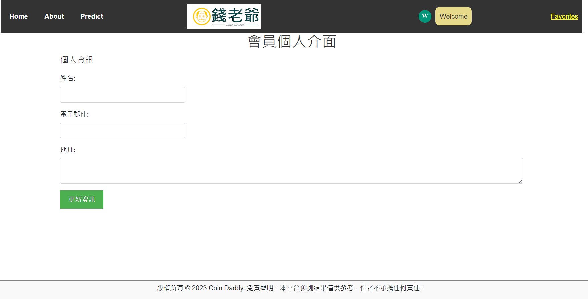  

目前還不能直接顯示會員的個人訊息，正在嘗試從資料庫當中獲取數據顯示於此頁面

### 更新
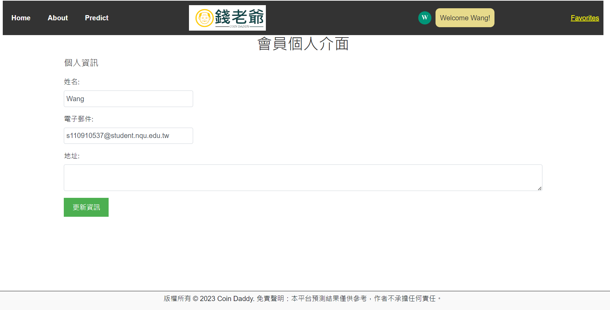  
已經可以顯示使用者的姓名及電子信箱位置，但還不能更改資料庫

## 預測介面
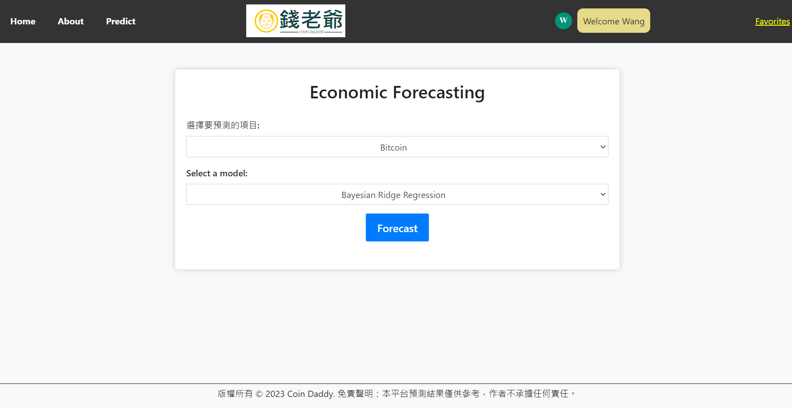  

- 增加了選擇預測項目的功能，使用者可以選擇一經濟項目進行預測。

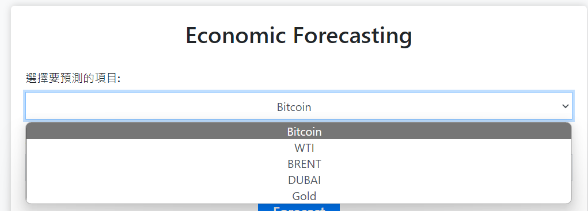  

## 持續更新中:
  

  

# 使用教學
## 配置環境
Anaconda官方教學:
> https://www.anaconda.com/blog/moving-conda-environments

Cd至(根目錄)於Terminal當中輸入

```conda env create -f environment.yml```

即可安裝環境

本專案使用**VScode**製作

於VScode切換到對應環境
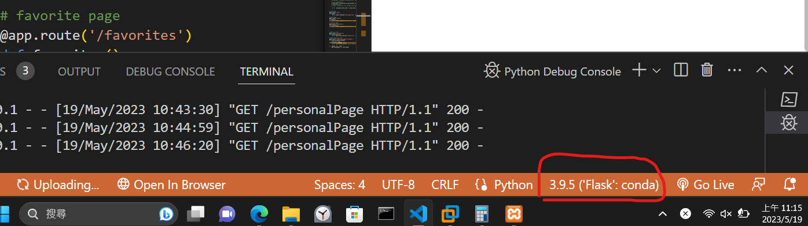  

## 安裝Xampp

#### Xampp configuration:
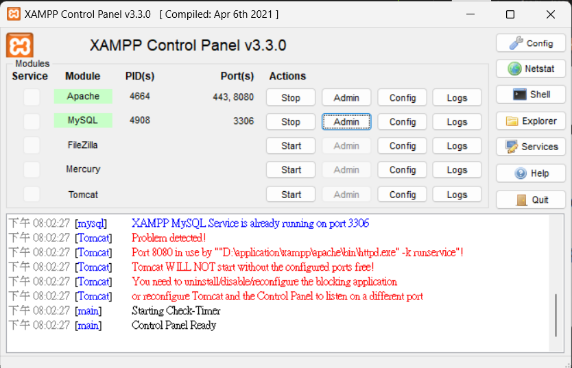  
> 修改自相同的port

### import sql file
From Xampp control panel
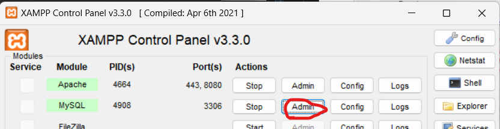  
可以進入到phpMyadmin介面

按下匯入
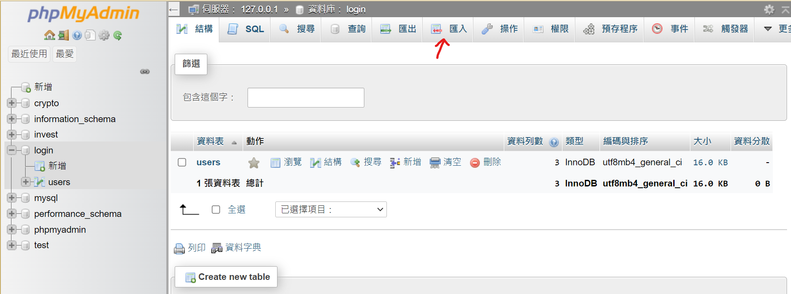  

按下選擇檔案
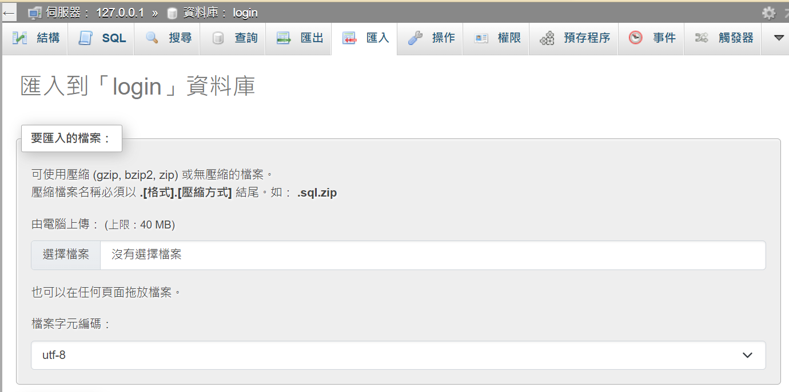  

於本專案資料夾根目錄可看到sql檔案
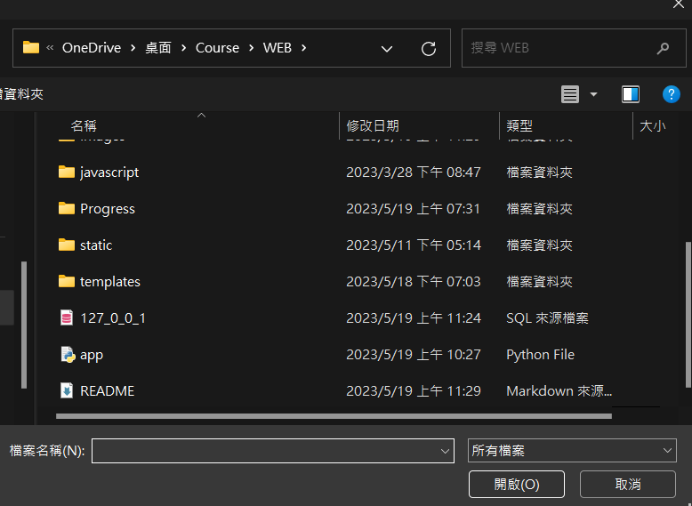  

點選127_0_0_1.sql
按開啟

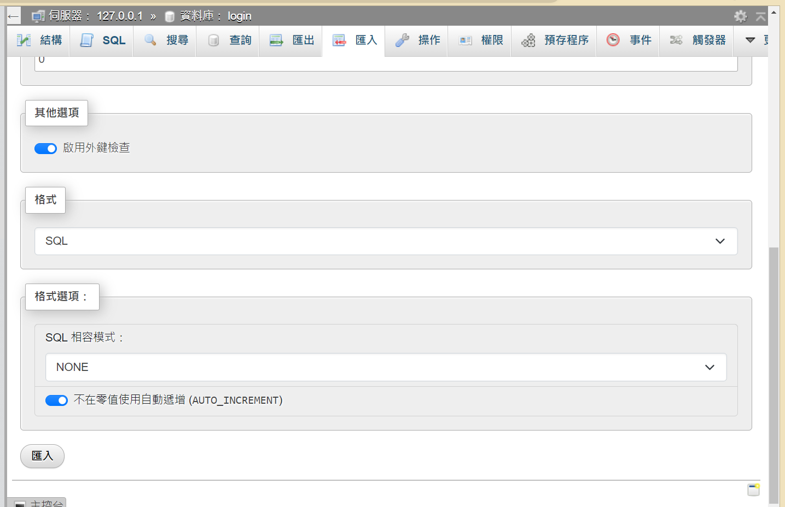  

將進度調移動到最下方可以看到匯入按鈕
點擊它即可匯入資料

### 運行app.py即可搭建預測平台


